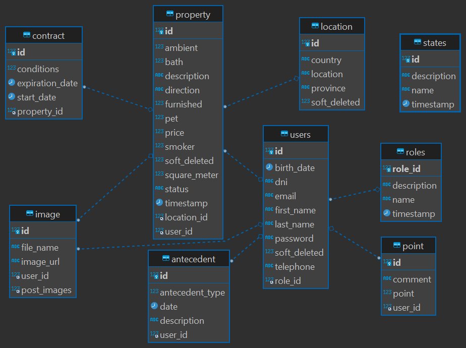

# s3-03-t-back-end
## Compañero ideal

Compañero ideal es una app para alquilar piezas para estudiantes que bienen del exterior a estudiar. 
En la app se registrar Usuarios de tipo propietario y inquilino.

<h3>Back End</h3>
<ul>
    <li>Java - 11</li>
    <li>Spring boot version "2.7.2" </li>
    <li>Spring Security</li>
    <li>Jpa, hibernate</li>
    <li>Swagger - Postman</li>
    <li>Lombok</li>
    <li>Arquitectura MVC</li>
</ul>

<h3>Front End</h3>
<ul>
    <li>Angular</li>
    <li>Html5, Css3</li>
    <li>JavaScript, Sass</li>
    <li>Typescript</li>
    <li>Font Awesome</li>
</ul>

<h3>Diseño UX UI</h3>
<ul>
    <li>Figma</li>
</ul>

<h4>Diagrama ER</h4>
<h1></h1> 

<h5>Back End</h5>
<ul>
    <li>Abel Acevedo Java Spring Boot :alien: :space_invader:[Abel3581](https://github.com/Abel3581)</li>
    <li>Gabriel Navarro Java Spring Boot :sunglasses: [gabynavarro](https://github.com/gabynavarro)</li>
    <li>Marcos Paz Goncheff Java Spring Boot :relaxed: (https://github.com/marcosep192000)</li>
</ul>

<h5>Front End</h5>
<ul>
    <li>Juan Bautista Iglesias :blush: </li>
</ul>

<h5>Diseño UX UI :heart_eyes:</h5>
<ul>
    <li>Johana Martinez</li>
    <li>Micaela Macedonio</li>
</ul>

##### Link Swagger: http://localhost:8080/swagger-ui/index.html